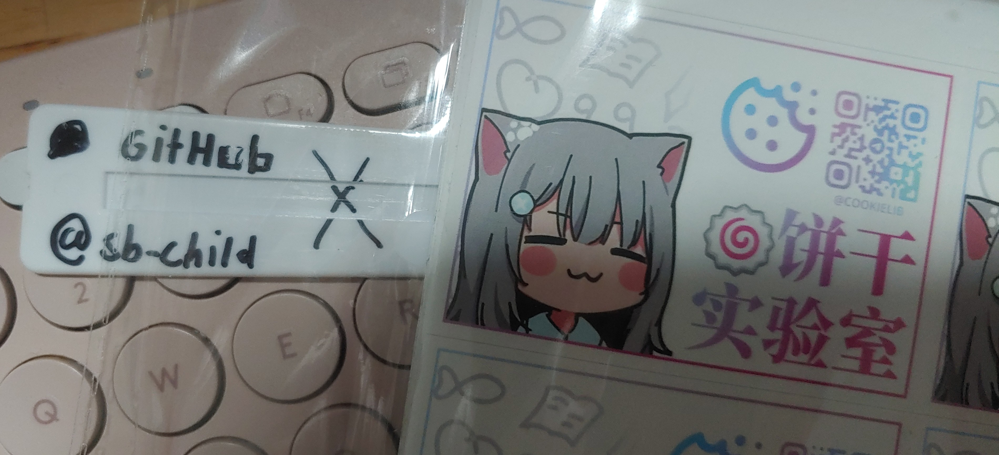

# Triple

`[持续更新中]` 适合带到三次元世界的可爱的插画们

⚠️ svg 的预览字体可能和实际字体不一致，请以 png 图片为准

---

## 可爱的图标们! 

| svg 预览 |
| --- |
|  |
| [查看svg原图](icons.svg) |

## Estradiol 杯! `Release/可生产`

[点击查看](estradiol-cup/README.md)

## Estradiol 衬衫! `Draft/草案`

> 准备首次生产中

[点击查看](estradiol-skirt/README.md)

## 奇怪的黑胶 CD 封面 (DVD 也可以吧) `Draft/草案`

> 目前不适合生产!!!

[点击查看](cd-cover/README.md)

---

## 编辑和贡献小贴士 / Edit & Contribute Tips

- 请安装[思源黑体](https://github.com/adobe-fonts/source-han-sans/releases/download/2.004R/SourceHanSans.ttc.zip), [霞鹜文楷](https://github.com/lxgw/LxgwWenKai/releases/download/v1.501/lxgw-wenkai-v1.501.zip)和[更纱黑体](https://github.com/be5invis/Sarasa-Gothic)
- 推荐 svg 编辑器: [Inkscape](https://inkscape.org/)
- 如果发现 Inkscape 导出的 png 是黑白色的... 请点击导出按钮右边的小齿轮看看设置
- 提交 PR 前，请确保 png 文件都是最新的 (记得导出)
- 如果编辑器找不到 `思源黑体` ，请将字体改为 `思源黑体 CN`，反之亦然。

## *钦定*经销商 / *Certified* Distributor

| 墨盒实验室 |
| --- |
|  |
| 淘宝: 墨守的小卖部 |
| 拼多多: 软兔守守的冬日暖意小屋 |

| 饼干实验室 |
| --- |
|  |
| Telegram 频道: https://t.me/cookielib |

你也在卖嘛？如果想让大家知道的话，欢迎开 issue 或提交 PR

## 许可证 / License

本 repo 下所有文件均使用 [cc by-sa 4.0](https://creativecommons.org/licenses/by-sa/4.0/) 许可证，详见 [License](LICENSE) 文件

### *钦定*经销商专用许可证 / License for *Certified* Distributor

对于钦定经销商，若无法遵守上述许可证，那么生产稿可以保持私有，但是必须遵守以下条件：

- 在最终产品中，或在附加文档中包含经销商署名（可以都包含，但至少其一包含）
