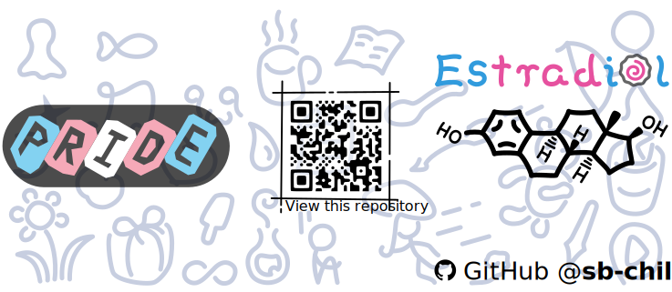
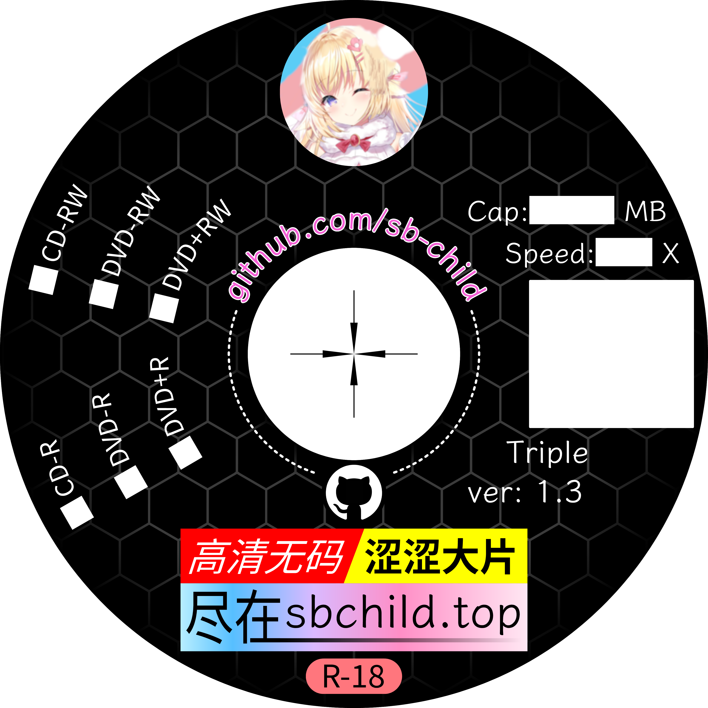

# Triple
[持续更新中] 适合带到三次元世界的可爱的插画们

⚠️ svg 的预览字体可能和实际字体不一致，请以 png 图片为准

**打开svg文件前，请安装[这个](https://github.com/adobe-fonts/source-han-sans/releases/download/2.004R/SourceHanSans.ttc.zip)和[这个](https://github.com/be5invis/Sarasa-Gothic)字体**

---

## 可爱的图标们！

| svg 预览 |
| --- |
|  |

## Estradiol 杯！

### 全尺寸版

| svg 预览 (Estradiol 杯 > 全尺寸版) |
| --- |
|  |
| [查看svg原图](estradiol.svg) [查看png文件](estradiol.png) |

(图案太大啦，建议做成挂画)

图片尺寸 19.5 x 8.5 cm，水杯直径 8 cm 高度 9.5 cm。给商家发送[这个](estradiol.png)图片，定制**水杯**~

### 小小版

| svg 预览 (Estradiol 杯 > 小小版) |
| --- |
|  |
| [查看svg原图](estradiol-small.svg) [查看png文件](estradiol-small.png) |

图片尺寸 19.5 x 8.5 cm，水杯直径 8 cm 高度 9.5 cm。给商家发送[这个](estradiol-small.png)图片，定制**水杯**~

### 左左版

| svg 预览 (Estradiol 杯 > 左左版) |
| --- |
|  |
| [查看svg原图](estradiol-small-left.svg) [查看png文件](estradiol-small-left.png) |

图片尺寸 19.5 x 8.5 cm，水杯直径 8 cm 高度 9.5 cm。给商家发送[这个](estradiol-small-left.png)图片，定制**水杯**~

### 右右版

| svg 预览 (Estradiol 杯 > 右右版) |
| --- |
|  |
| [查看svg原图](estradiol-small-right.svg) [查看png文件](estradiol-small-right.png) |
| 商家给的效果图 |
|  |

图片尺寸 19.5 x 8.5 cm，水杯直径 8 cm 高度 9.5 cm。给商家发送[这个](estradiol-small-right.png)图片，定制**水杯**~

## 奇怪的黑胶 CD 封面 (DVD 也可以吧)

| png 预览 (奇怪的黑胶 CD 封面) |
| --- |
|  |
| [查看svg原图](cover-prod.svg) [查看png文件](cover-prod.png) |
| 渲染效果图 |
|  |

图片尺寸 8 x 8 cm，给商家发送[这个](cover-prod.png)图片，定制**转印贴**~

不过它确实是为 120 mm 的**黑胶** CD 定制的... 80 mm 的 CD 应该也可以贴上

(市面上的黑胶 CD 的可打印部分最外圈直径是 70 mm，内圈直径是 24 mm)

---

## 编辑和贡献小贴士 / Edit & Contribute Tips

- 记得先安装字体
- 请使用 Inkscape 编辑 svg 文件
- 如果发现 Inkscape 导出的 png 是黑白色的... 请点击导出按钮右边的小齿轮看看设置
- 提交 PR 前，请确保 png 文件都是最新的 (记得导出)

## *钦定*经销商 / *Certified* Distributor

| 墨盒实验室 |
| --- |
|  |
| 淘宝: 墨守的小卖部 |
| 拼多多: 软兔守守的冬日暖意小屋 |

你也在卖嘛？如果想让大家知道的话，欢迎开 issue 或提交 PR

## 许可证 / License

本 repo 下所有文件均使用 [cc by-sa 4.0](https://creativecommons.org/licenses/by-sa/4.0/) 许可证，详见 [License](LICENSE) 文件
